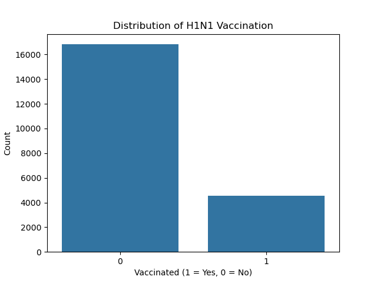
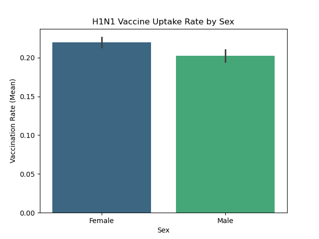
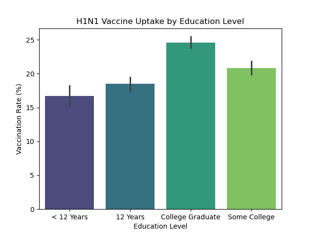
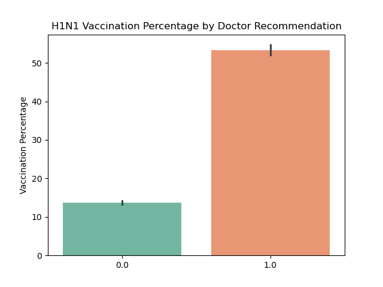
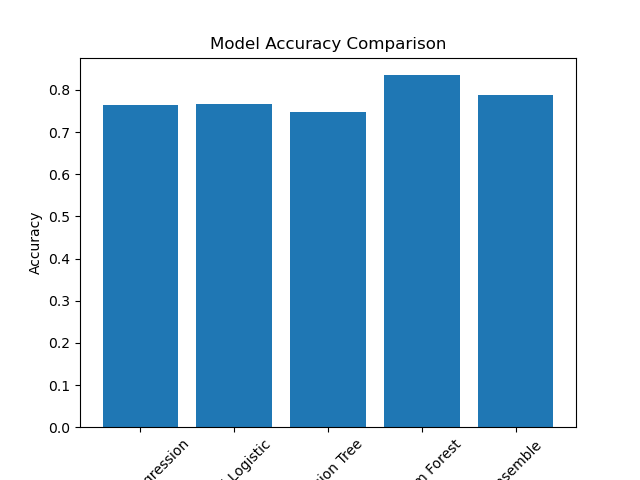

# H1N1 Vaccine Prediction Project

## Project Overview

This project uses machine learning to predict whether individuals received the **H1N1 vaccine** using data from the **National 2009 H1N1 Flu Survey**.

The goal is to better understand factors associated with vaccination behavior and support public health decision-making during disease outbreaks such as H1N1 influenza.

This is a **binary classification problem**, where the model predicts:

* **1** → Individual received the vaccine
* **0** → Individual did not receive the vaccine

---

## Objective

To build and compare multiple classification models in order to:
* Identify the best-performing predictive model
* Evaluate model performance using appropriate metrics
* Apply ensemble modeling techniques
* Interpret results in a public health context

---

## Stakeholders

1. Public Health Organizations to design targeted vaccination campaigns and improve public health strategies.
2. Healthcare Providers to help them better communicate the importance of vaccination.
3. Government Health Policy Makers to create policies that improve vaccine accessibility and coverage.
4. Public Health Researchers and Epidemiologists.

--
## Dataset

The dataset contains demographic, behavioral, and attitudinal variables such as:
* Age group
* Education level
* Health status
* Risk perception
* Doctor recommendations
* Household information
* Behavioral indicators


Target variable:
* `h1n1_vaccine`

---

## Methodology

The project follows a structured machine learning workflow:

### 1 Data Preprocessing

* Train_test split
* The Transformation Pipeline
The data was split into three distinct streams based on feature type:
Numeric Stream:
- Imputation: Missing values filled using the Median to stay robust.
- Scaling: StandardScaler applied to ensure that features with larger ranges (like household size) don't dominate features with smaller ranges.

Ordinal Stream (Ranked Categories):
- Features: age_group, education, and income_poverty.
- Logic: Unlike standard encoding, I defined manual rankings (e.g., College Graduate > Some College). This preserves the mathematical relationship between life stages and socioeconomic status.

Nominal Stream (Categorical):
- Features: race, sex, marital_status, etc.
- Encoding: OneHotEncoder was used with drop='if_binary' to reduce redundancy (preventing the "Dummy Variable Trap") while allowing the model to treat different groups independently without implying a numerical order.
--

### Data visualizations

##### Target Distribution
The dataset shows the distribution of individuals who received the H1N1 vaccine versus those who did not.


##### Vaccine Uptake by Sex
This visualization shows differences in vaccination uptake between male and female respondents.


##### Vaccine Uptake by Education Level
Education level may influence health awareness and attitudes toward vaccination.


##### Doctor Recommendation and Vaccine Uptake
Healthcare provider recommendations are often a strong predictor of vaccination behavior.


### 2 Model Development

The following models were implemented:
* Logistic Regression (Baseline Model)
* Tuned Logistic Regression
* Decision Tree
* Random Forest (Ensemble Model)
* Voting Classifier (Ensemble Combination Model)

---

## Evaluation Metrics

Models evaluated using:

* **Accuracy**
* **ROC-AUC Score**
* **Precision**
* **Recall**
* **F1-Score**
* **ROC Curves**
ROC-AUC was particularly important because the dataset is slightly imbalanced.

## Model Comparison
The following visualization compares the predictive performance of the machine learning models developed in this project.


---

## Final Model

The **Random Forest ensemble model** achieved the best overall performance, with the highest accuracy and strong ROC-AUC score.
This model was selected as the final model because it:
* Captured complex patterns in the data
* Provided strong predictive performance
* Performed better than simpler models

---

## Final Predictions on Unseen Data
The ultimate goal of this project was to apply the trained Random Forest model to an "unseen" dataset (test_set_features.csv) to predict the likelihood of individuals receiving the H1N1 vaccine.

* Methodology
To maintain scientific integrity, the unseen data underwent the exact same transformation process as the training data:
- No Data Leakage: The preprocessor was not refitted; it used the parameters (means, medians, and encodings) established during the training phase.
- Output Types: The model generated two distinct types of outputs:
= Class Labels: A binary 0 or 1, representing the final "Yes/No" prediction.
- Probability Scores: A continuous value between 0.0 and 1.0, indicating the model's confidence in the vaccine uptake.

## Conclusion
The model demonstrates that vaccination behavior is influenced not only by demographic factors but also by perceptions, knowledge, and healthcare interactions.
* Doctor recommendations and personal risk perception strongly influence vaccination behavior.
* Ensemble methods improved predictive performance compared to a single decision tree.
* Handling class imbalance improved recall for vaccinated individuals.


---

## Reference

DrivenData. (2020). Flu Shot Learning: Predict H1N1 and Seasonal Flu Vaccines. Retrieved [Month Day Year] from https://www.drivendata.org/competitions/66/flu-shot-learning.
--
--
##  Project Structure

```
H1N1-Vaccine-Prediction/
│
├── data/
│   ├── training_set_features.csv
│   ├── training_set_labels.csv
│   └── test_set_features.csv
│
├── images/
│   ├── target_distribution.png
│   ├── model_comparison.png
│   ├── vaccine_uptake_by_sex.png
│   ├── vaccine_uptake_by_education.png
│   ├── vaccine_uptake_doctor_recommendation.png
│   ├── vaccine_uptake_health_workers.png
│   └── h1n1_knowledge_vaccination.png
│
├── h1n1_vaccine_analysis.ipynb     
├── H1N1ML.pdf                       
├── requirements.txt
└── README.md

