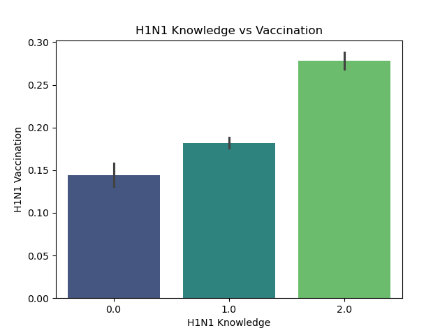

# H1N1 Vaccine Prediction Project

## Project Overview

This project applies machine learning techniques to predict H1N1 vaccine uptake using demographic, behavioral, and health-related data from the 2009 H1N1 Flu Survey. The goal is to understand the key factors influencing vaccination decisions and support data-driven public health strategies.

Multiple classification models were developed and evaluated, including Logistic Regression, Decision Tree, Random Forest, and an ensemble Voting Classifier. Among these, the Random Forest model achieved the best performance, with approximately 84% accuracy and strong ability to distinguish between vaccinated and non-vaccinated individuals.

The analysis revealed that factors such as doctor recommendation, perceived risk of infection, and belief in vaccine effectiveness play a significant role in vaccination behavior. These insights can be used to design targeted interventions and improve vaccine uptake in future public health campaigns.

The goal is to better understand factors associated with vaccination behavior and support public health decision-making during disease outbreaks such as H1N1 influenza.

This is a **binary classification problem**, where the model predicts:

* **1** → Individual received the vaccine
* **0** → Individual did not receive the vaccine

---

## Objective

To build and compare multiple classification models in order to:
* Identify the best-performing predictive model
* Evaluate model performance using appropriate metrics
* Apply ensemble modeling techniques
* Interpret results in a public health context

---

## Stakeholders

1. Public Health Organizations to design targeted vaccination campaigns and improve public health strategies.
2. Healthcare Providers to help them better communicate the importance of vaccination.
3. Government Health Policy Makers to create policies that improve vaccine accessibility and coverage.
4. Public Health Researchers and Epidemiologists.

--
## Dataset

### 📂 Files Used
- `training_set_features.csv` – Input variables  
- `training_set_labels.csv` – Target variable  
- `test_set_features.csv` – Unseen data for prediction 

The dataset contains key features of;
- **Demographics**: age group, sex, race, education  
- **Health factors**: chronic conditions, health worker status  
- **Behavioral factors**: mask usage, hand washing  
- **Perceptions**: vaccine effectiveness, risk perception  
- **External influence**: doctor recommendation


Target variable:
* `h1n1_vaccine`

---

## Methodology

The project follows a structured machine learning workflow:

### 1 Data Preprocessing

* Train_test split
* The Transformation Pipeline
The data was split into three distinct streams based on feature type:
Numeric Stream:
- Imputation: Missing values filled using the Median to stay robust.
- Scaling: StandardScaler applied to ensure that features with larger ranges (like household size) don't dominate features with smaller ranges.

Ordinal Stream (Ranked Categories):
- Features: age_group, education, and income_poverty.
- Imputation: Missing values filled using the Mode
- Logic: Unlike standard encoding, I defined manual rankings (e.g., College Graduate > Some College). This preserves the mathematical relationship between life stages and socioeconomic status.

Nominal Stream (Categorical):
- Features: race, sex, marital_status
- Imputation: Missing values filled using the Mode
- Encoding: OneHotEncoder was used with drop='if_binary' to reduce redundancy (preventing the "Dummy Variable Trap") while allowing the model to treat different groups independently without implying a numerical order.
--

### Data visualizations

##### Target Distribution
The dataset shows the distribution of individuals who received the H1N1 vaccine versus those who did not.

The dataset shows an imbalance, with more individuals not receiving the vaccine.

### Vaccination Patterns

##### Vaccine Uptake by Sex
This visualization shows differences in vaccination uptake between male and female respondents.


##### Vaccine Uptake by Education Level
Education level may influence health awareness and attitudes toward vaccination.


### Behavioural Insights

##### H1N1 Knowledge


##### Doctor Recommendation and Vaccine Uptake
Healthcare provider recommendations are often a strong predictor of vaccination behavior.


Doctor recommendation shows a strong influence on vaccination uptake.

---

### 2 Model Development

The following models were implemented:
* Logistic Regression (Baseline Model)- establishes a performance benchmark and allows understanding of how individual features influence vaccination probability
* Tuned Logistic Regression- to improve model performance and reduce overfitting.
* Decision Tree - provides a rule-based structure that is easy to interpret and visualize. captures non-linear relationships between variables.
* Random Forest (Ensemble Model) - combines multiple decision trees to improve accuracy and reduce overfitting. Handles complex interactions between variables.
* Voting Classifier (Ensemble Combination Model) - combines predictions from Logistic Regression, Decision Tree, Random Forest models used to produce a final prediction

---

## Evaluation Metrics

Models evaluated using:

* **Accuracy**
* **ROC-AUC Score**
* **Precision**
* **Recall**
* **F1-Score**
* **ROC Curves**
ROC-AUC was particularly important because the dataset is highly imbalanced.

## Model Comparison
The following visualization compares the predictive performance of the machine learning models developed in this project.


---
### Summary:

| Model | Accuracy | ROC-AUC |
|------|--------|--------|
| Logistic Regression | 0.77 | 0.82 |
| Decision Tree | 0.75 | 0.64 |
| Random Forest | **0.84** | 0.82 |
| Ensemble Model | 0.79 | 0.80 |

The **Random Forest model** performed best overall.

## Final Model

The **Random Forest ensemble model** achieved the best overall performance, with the highest accuracy and strong ROC-AUC score.
This model was selected as the final model because it:
* Captured complex patterns in the data
* Provided strong predictive performance
* Performed better than simpler models

---

## Final Predictions on Unseen Data
The ultimate goal of this project was to apply the trained Random Forest model to an "unseen" dataset (test_set_features.csv) to predict the likelihood of individuals receiving the H1N1 vaccine.

* Methodology
To maintain scientific integrity, the unseen data underwent the exact same transformation process as the training data:
- No Data Leakage: The preprocessor was not refitted; it used the parameters (means, medians, and encodings) established during the training phase.
- Output Types: The model generated two distinct types of outputs:
= Class Labels: A binary 0 or 1, representing the final "Yes/No" prediction.
- Probability Scores: A continuous value between 0.0 and 1.0, indicating the model's confidence in the vaccine uptake.

## Conclusion
The model demonstrates that vaccination behavior is influenced not only by demographic factors but also by perceptions, knowledge, and healthcare interactions.
* Doctor recommendations and personal risk perception strongly influence vaccination behavior.
* Ensemble methods improved predictive performance compared to a single decision tree.
* Handling class imbalance improved recall for vaccinated individuals.

---

## Limitations

- Class imbalance affects prediction of vaccinated individuals  
- Data is based on self-reported survey responses  
- Model may not generalize to different populations 

## Reference

DrivenData. (2020). Flu Shot Learning: Predict H1N1 and Seasonal Flu Vaccines. Retrieved [Month Day Year] from https://www.drivendata.org/competitions/66/flu-shot-learning.
--
--
##  Project Structure

```
H1N1-Vaccine-Prediction/
│
├── data/
│   ├── training_set_features.csv
│   ├── training_set_labels.csv
│   └── test_set_features.csv
│
├── images/
│   ├── target_distribution.png
│   ├── model_comparison.png
│   ├── vaccine_uptake_by_sex.png
│   ├── vaccine_uptake_by_education.png
│   ├── vaccine_uptake_doctor_recommendation.png
│   ├── vaccine_uptake_health_workers.png
│   └── h1n1_knowledge_vaccination.png
│
├── h1n1_vaccine_analysis.ipynb     
├── H1N1ML.pdf                       
├── requirements.txt
└── README.md

